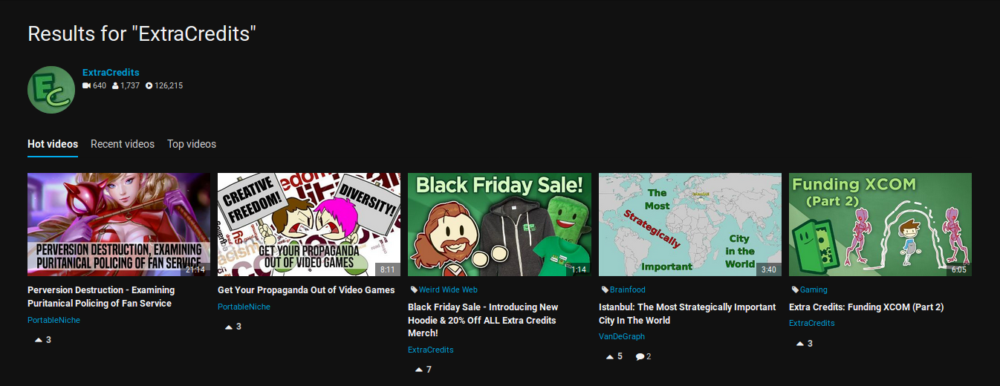
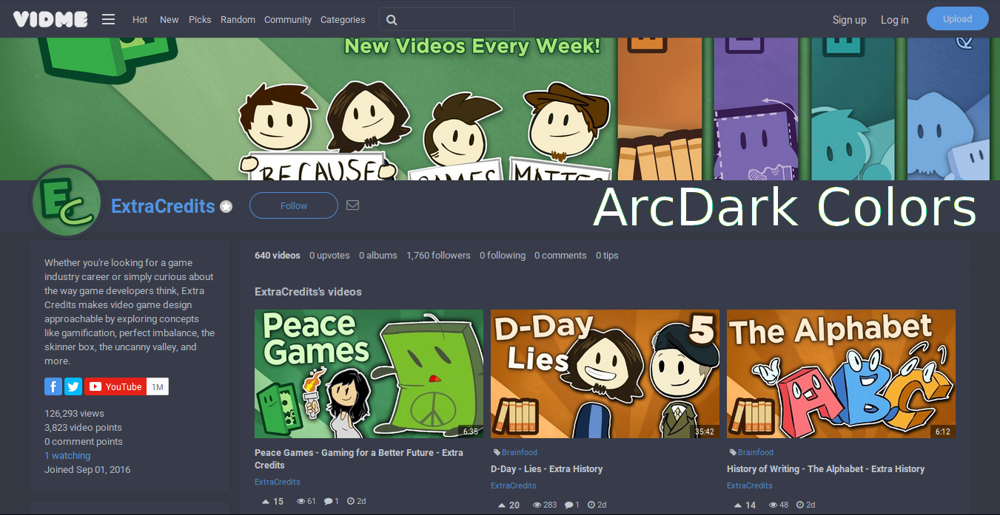
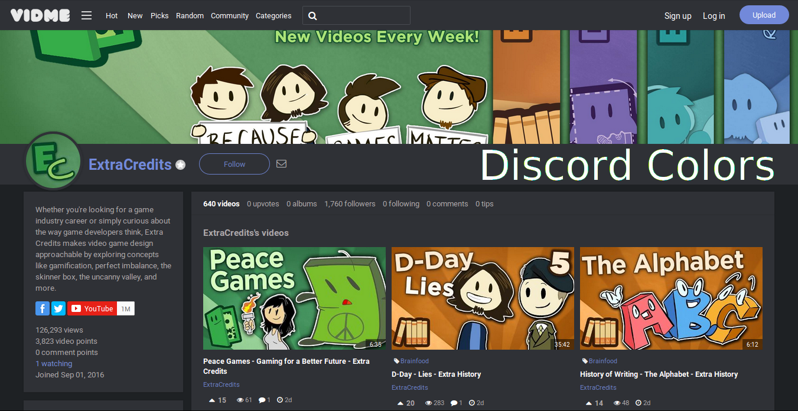
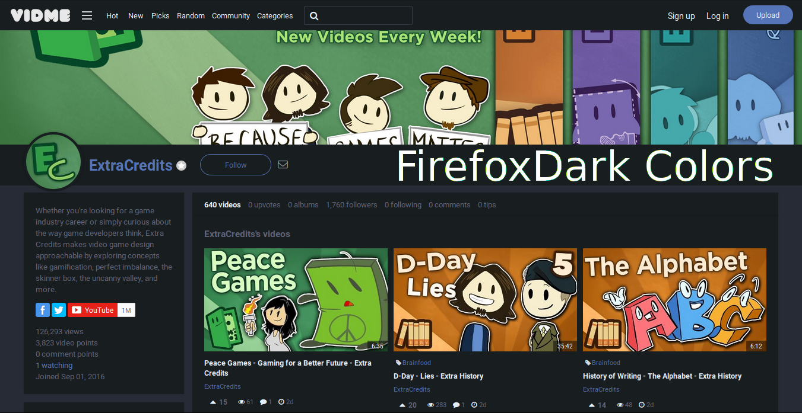
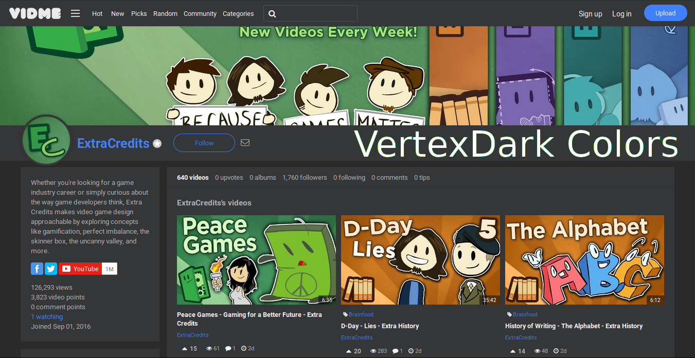

# Vidme-DeepDark (sad to see vidme being suspended)

Videos should only be watched in the dark. May the dark be kinder on thine eyes. (Vid.me dark theme) 

This is a dark theme for vid.me inspired by [FT DeepDark](https://addons.mozilla.org/en-US/firefox/addon/ft-deepdark/?src=search).

Also, credit where credit is due for the color palettes down bellow. ([@KDE](https://github.com/KDE), [@horst3180](https://github.com/horst3180), [@linuxmint](https://github.com/linuxmint), [YouTube](https://www.youtube.com/) and [Discord](https://discordapp.com/))

Theme as userstyle [here](https://userstyles.org/styles/146161/vidme-deepdark).

### **You can also install all my themes at once from [here](https://gitlab.com/RaitaroH/Import-All-Deepdark).**

# Screenshots
Channel page

Video

Comments

Search results

# Colors
Colors are available in the code, at the top. Uncomment one of the provided colors.

The next screenshot(s) display a newer vidme page layout. I didn't remake the above just for this.

